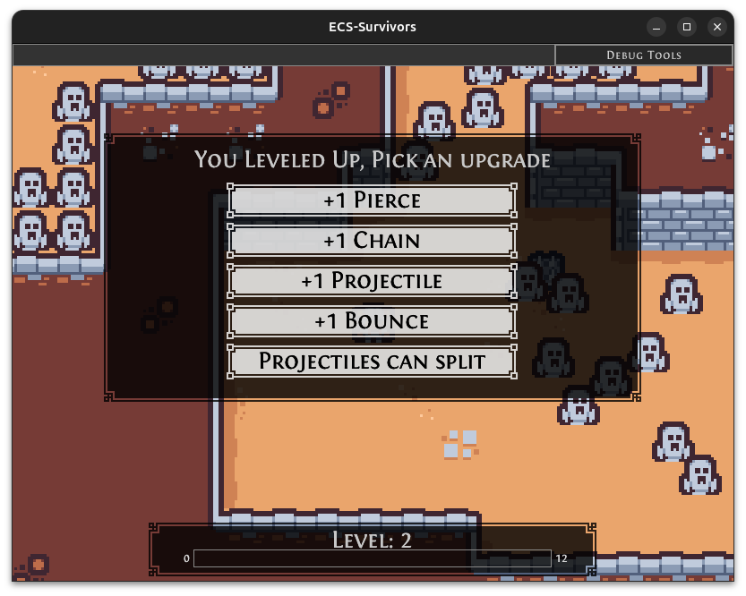
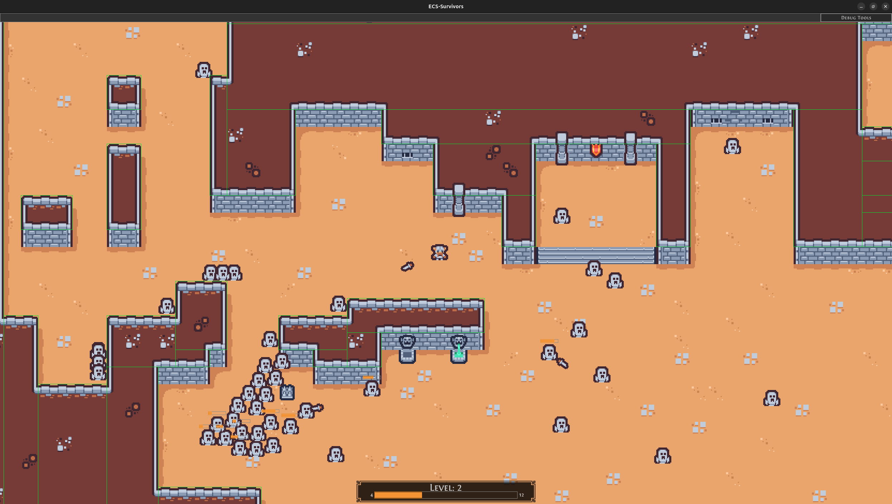

# ECS Survivors

ECS Survivors is a survivor-like game which is meant to showcase what Entity Component System (ECS) can do. This game is built using [Flecs](https://www.flecs.dev/flecs/index.html) for the ECS framework and uses the [Raylib](https://www.raylib.com/) game library for the rendering, sounds, and other functions relevant to game development.

I am taking this opportunity to learn myself about game development with ECS, taking a more hands-on approach by using lower-level libraries than common game engines provide you with.

While developing this game, I will document most of the work through [blog-posts](https://blog.ptidej.net/). Every blog will be contained in separate branches, and the main one will have the most recent changes.

## Blog Entries:
- [Part-I: Setup](https://blog.ptidej.net/ecs-survivors-part-i/)
- [Part-II: Rendering Pipeline and GUI](https://blog.ptidej.net/ecs/)
- [Part-III: Player and Enemy Movement](https://blog.ptidej.net/ecs-game/)<br>
- [Part-IV: Collisions](https://blog.ptidej.net/ecs-survivors-part-iv/)<br>
- [Part-V: Gameplay](https://blog.ptidej.net/ecs-survivors-part-v-gameplay/)<br>
- [Part-VI: Code Refactor](https://blog.ptidej.net/ecs-survivors-part-vi-code-refactor/)<br>
- Part-VII - X: Tilemaps - Accelerated Collisions - Levelling Up - Yet Another Code Refactor (Coming Soon)<br>

You can also play the latest build on [Itch.io](https://laurent-voisard.itch.io/ecs-survivors)


## Gallery:
 
*<center> The game </center>*


*<center> Player progression </center>*


*<center> Tiled integration using tmxlite </center>*

## Tools & Assets Used

- [flecs](https://github.com/SanderMertens/flecs) (MIT license)
- [raylib](https://github.com/raysan5/raylib) (Zlib license)
- [tmxlite](https://github.com/fallahn/tmxlite) (Zlib license)
- [tilemap art](https://kenney.nl/assets/tiny-dungeon) (CCO license)

# Building with CMake for Desktop

I'm not proficient with c++ build systems so I will not explain in detail how to build this repository. I myself am using CLion on Windows. I'm fairly certain that using the command line
- cmake mkdir build
- cd build
- cmake ..
- cmake --build . -target ECS_Survivors
specify for release of debug.

# Building with CMake for Web Assembly

I wanted to make sure that building for web would be easy, that way I can have a playable build easily accessible on [Itch.io](https://laurent-voisard.itch.io/ecs-survivors)
Thankfully Raylib and Flecs can both be compiled to web assembly and Raylib provides a comprehensive [guide](https://github.com/raysan5/raylib/wiki/Working-for-Web-(HTML5)) to do so. I suggest you follow it yourself before attempting to build this repository. Once you have all the pre-required tools installed simply add the following arguments to the cmake command: 

-DPLATFORM="Web" -DCMAKE_TOOLCHAIN_FILE=<path_to_emsdk>/upstream/emscripten/cmake/Modules/Platform/Emscripten.cmake

When the build is complete, navigate to the .html file and run this command: ```python -m http.server 8080```

# Contact
laurent.voisard@mail.concordia.ca
